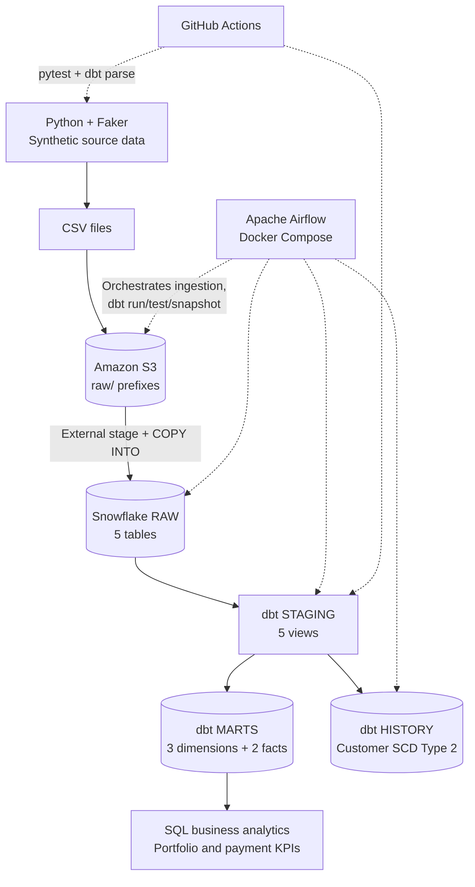
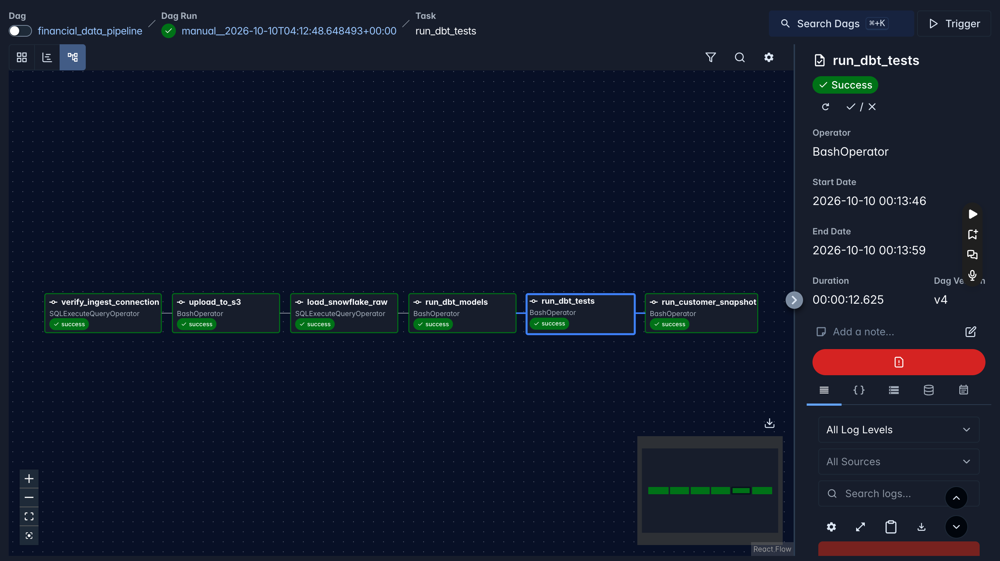
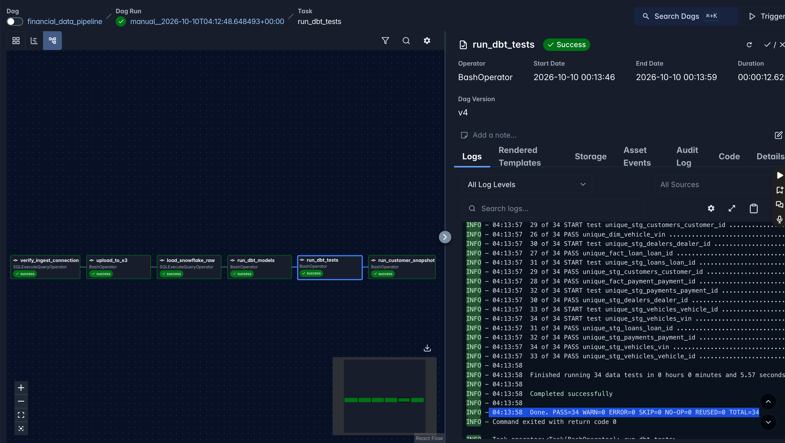

# Cloud Financial Data Platform

**End-to-end data engineering portfolio project | Python · AWS S3 · Snowflake · dbt · Apache Airflow · Docker · GitHub Actions**

A cloud-based ELT pipeline that simulates an automotive lending data platform. It generates **synthetic** customer, dealer, vehicle, loan, and payment records; lands CSV files in Amazon S3; loads them into Snowflake; transforms them into tested dimensional models with dbt; and orchestrates the workflow with a Dockerized Apache Airflow DAG.

**Status:** Implemented and successfully validated in October 2026. This is a local, manually triggered portfolio deployment—not a continuously operated production service. The Snowflake trial environment may no longer be available; the code, test configuration, SQL, and execution evidence are retained here.

## Results at a glance

| Verified outcome | Result |
| --- | ---: |
| Customers / dealers / vehicles | 1,000 / 250 / 1,500 |
| Loan records | 1,200 |
| Payment records after incremental load | **33,789** |
| Newly processed payment records | **5** |
| Customer history snapshot rows | **1,001** for 1,000 customers |
| dbt data tests against Snowflake | **34 passed**, 0 errors |
| Python unit tests | **23 passed** |
| Airflow orchestration | **6 of 6 tasks successful** |
| GitHub Actions | Python tests **and** offline dbt parsing passed |

Counts and test outcomes above reflect a completed demonstration run, not real-time production metrics.

## Architecture



**Processing pattern:** generate locally → upload to S3 → Snowflake external stage → `COPY INTO` RAW → dbt staging views → dimensional marts → data-quality tests → customer-history snapshot → business SQL analysis.

AWS IAM controls access to the project S3 bucket. A Snowflake storage integration uses a dedicated AWS IAM role to read staged files; separate Snowflake roles are used for RAW ingestion and transformations.

## Data model

| Layer | Objects | Purpose |
| --- | --- | --- |
| `RAW` | `CUSTOMERS`, `DEALERS`, `VEHICLES`, `LOANS`, `PAYMENTS` | Loaded source records from S3 |
| `STAGING` | Five `stg_*` views | Select and standardize source columns for modeling |
| `MARTS` | `dim_customer`, `dim_dealer`, `dim_vehicle` | Descriptive dimensions |
| `MARTS` | `fact_loan`, `fact_payment` | Lending and payment measures |
| `HISTORY` | `customer_history` | Customer attribute version history (SCD Type 2) |

`fact_loan` references customer, dealer, and vehicle IDs; `fact_payment` references loan IDs. dbt relationships tests validate those links. Four marts are materialized as tables; `fact_payment` overrides the default to an incremental model.

## Orchestration with Apache Airflow

The [Airflow DAG](airflow/dags/financial_data_pipeline.py), `financial_data_pipeline`, executes these tasks in order:

1. `verify_ingest_connection` — check the Snowflake ingestion-role connection.
2. `upload_to_s3` — upload source CSV files without replacing existing objects.
3. `load_snowflake_raw` — run explicit `COPY INTO` commands against the external S3 stage.
4. `run_dbt_models` — build staging and mart models.
5. `run_dbt_tests` — execute data-quality tests.
6. `run_customer_snapshot` — capture customer attribute changes.

The DAG is **manually triggered** (`schedule=None`), limits concurrent DAG runs to one, and configures one task retry with a two-minute delay. The local stack uses Apache Airflow 3.3.2, Postgres, Redis, and Celery workers via Docker Compose.



## Engineering patterns demonstrated

### Incremental processing and repeat-run safeguards

- The S3 uploader [`src/upload_to_s3_once.py`](src/upload_to_s3_once.py) uses a conditional `PutObject` request (`IfNoneMatch="*"`) to avoid overwriting an existing object with the same key.
- [`sql/airflow_load_raw.sql`](sql/airflow_load_raw.sql) targets specific files and uses Snowflake `COPY INTO ... FORCE = FALSE`, allowing Snowflake load history to skip previously loaded files under supported conditions.
- [`fact_payment.sql`](cloud_financial_dbt/models/marts/fact_payment.sql) is an incremental dbt model with `payment_id` as the unique key and the `merge` strategy. Its incremental filter selects **previously unseen payment IDs**, rather than updating already-loaded payments.
- An additional five-payment CSV was processed, increasing verified payment records from **33,784 to 33,789**, with **33,789 distinct payment IDs**.

These are practical repeat-run safeguards, **not** a blanket guarantee of exactly-once behavior for every source change, file replacement, or Snowflake load-history expiry scenario.

### Slowly Changing Dimension (SCD Type 2)

[`customer_history.sql`](cloud_financial_dbt/snapshots/customer_history.sql) uses dbt's `check` snapshot strategy and `customer_id` as its unique key. It monitors name, email, phone, and location attributes. A controlled change to one synthetic customer produced **1,001 history rows**, representing **1,000 distinct customers** and **1,000 current versions**. The previous version retains a `dbt_valid_to` timestamp; the current version has a null `dbt_valid_to`.

[View SCD Type 2 evidence](docs/screenshots/scd2_customer_history.png)

### Testing and CI

- **34 dbt data tests** ran successfully against the Snowflake models: `not_null`, `unique`, and relationship checks across staging and marts.
- **23 Python tests** exercise synthetic data generation, validations, and S3 upload behavior.
- [GitHub Actions workflow](.github/workflows/python-tests.yml) runs Python tests and a separate **offline `dbt parse`** job for pushes/PRs to `main`.
- The CI-only [dbt profile](.github/dbt/profiles.yml) uses nonfunctional placeholders; CI parsing requires **no Snowflake credentials or running warehouse**. Parsing does **not** replace execution of SQL models or live dbt data tests.



[GitHub Actions test evidence](docs/screenshots/github_actions_ci_success.png) · [Snowflake row-count reconciliation](docs/screenshots/snowflake_pipeline_row_counts.png) · [Incremental-load verification](docs/screenshots/incremental_payment_validation.png)

## Financial analytics

[`sql/business_analytics.sql`](sql/business_analytics.sql) contains five business-facing analyses against the marts:

| Analysis | Verified demonstration result |
| --- | --- |
| Payment performance | 29,174 on-time; 2,886 late; 928 partial; 801 missed payment records |
| Overdue-payment metric | 4,565 of 33,789 payment records had `days_late > 0` (**13.51%**) |
| Loan portfolio by province | Loan count, total amount and average amount across 13 provinces/territories |
| Dealer origination performance | Top 10 dealers by **total loan amount** |
| Dimensional reconciliation | 1,200 loans and **$168,479,040.73** before and after customer/dealer joins |

The overdue-payment percentage is a **record-level synthetic-data metric**, not a formal delinquency or default rate for a real lending portfolio. Synthetic geography and payment behavior should not be interpreted as real Canadian market patterns.

[Payment-status analysis](docs/screenshots/payment_performance_analytics.png) · [Overdue-payment metric](docs/screenshots/payment_delinquency_analysis.png) · [Province analysis](docs/screenshots/loan_portfolio_by_province.png) · [Dealer performance](docs/screenshots/dealer_performance_analytics.png) · [Loan reconciliation](docs/screenshots/loan_reconciliation.png)

## Repository guide

| Location | Contents |
| --- | --- |
| [`src/`](src/) | Dataset generators, validators, S3 upload scripts |
| [`tests/`](tests/) | Python unit tests |
| [`sql/`](sql/) | Snowflake setup, IAM-role-related grants, stage, load and analytics SQL |
| [`cloud_financial_dbt/`](cloud_financial_dbt/) | dbt sources, staging, marts, generic tests, snapshot, macros |
| [`airflow/`](airflow/) | Docker Compose environment, custom image and six-task DAG |
| [`.github/`](.github/) | GitHub Actions workflow and fake dbt parsing profile |
| [`docs/screenshots/`](docs/screenshots/) | Selected evidence from the validated run |
| [`data/raw/`](data/raw/) | Local generated CSV destination; data files ignored by Git |

## Reproduce and explore

**Requirements:** Python 3.13, Git, AWS credentials with access to your own S3 bucket, a Snowflake account for live runs, dbt-snowflake, and Docker Desktop for the Airflow stack. This repository provides a portfolio implementation, **not a zero-configuration deployment**; the Snowflake stage/IAM trust relationship, dbt connection profile, and Airflow connection must be configured in your own environment.

### Run local generators and Python tests

From the repository root:

```bash
python3 -m venv .venv
source .venv/bin/activate
python -m pip install -r requirements.txt
python -m pytest -v

python src/generate_customers.py
python src/generate_dealers.py
python src/generate_vehicles.py
python src/generate_loans.py
python src/generate_payments.py
```

The scripts write synthetic CSVs under `data/raw/` and validate generated records. Some generated values, particularly payment dates and counts, can vary with the execution date; the verified counts in this README belong to the recorded demonstration run.

### Configure AWS and Snowflake for a live run

1. Copy `.env.example` to a local `.env`, then set your bucket and AWS region. **Never commit credentials.** Authenticate to AWS using an appropriately scoped identity and temporary credentials.
2. Create your own S3 bucket and least-privilege permissions. Review [`sql/create_storage_integration.sql`](sql/create_storage_integration.sql) and [`sql/create_external_stage.sql`](sql/create_external_stage.sql) and replace their **placeholder** bucket/role identifiers; configure AWS trust and access for Snowflake's storage integration.
3. Provision the Snowflake warehouse, database and RAW tables with the scripts under [`sql/`](sql/), and grant the ingestion/transformation roles only the access they need. Review the scripts **before execution**; some setup statements use `ACCOUNTADMIN` and warehouse configuration may change cost controls.
4. Configure your local `~/.dbt/profiles.yml` with a valid Snowflake connection for the project profile `cloud_financial_dbt`. For live dbt runs, use `dbt run`, `dbt test`, and `dbt snapshot` in `cloud_financial_dbt/` after RAW is populated.
5. To use the [Airflow Docker stack](airflow/docker-compose.yaml), supply a local, untracked `airflow/.env`, Airflow's Snowflake connection (`snowflake_ingest`), and the required local AWS/dbt configuration. Review the bind mounts before running `cd airflow && docker compose up --build -d`. Trigger the DAG manually in the Airflow UI at `http://localhost:8080`; stop with `docker compose down` (**without** `-v` to retain local volumes).

The Airflow load SQL lists the original and one incremental payments file explicitly; additional increments require configuration changes. Starting live infrastructure may incur AWS/Snowflake charges. The original Snowflake demonstration warehouse was suspended with automatic resume disabled after evidence collection.

### Run offline dbt validation (no Snowflake connection)

```bash
python -m pip install dbt-snowflake==1.12.0
dbt parse --project-dir cloud_financial_dbt --profiles-dir .github/dbt --target ci
```

This is the same basic parsing check used in GitHub Actions; the dummy CI profile must **never** be used for actual warehouse execution.

## Security, scope and future enhancements

- Synthetic data only: no real financial accounts, customer records, or company data are required.
- Local `.env` files, generated CSVs and credentials are excluded by `.gitignore`; avoid copying sensitive identifiers into public screenshots.
- IAM-limited S3 access, a Snowflake storage integration and separate ingestion/transformation roles reduce broad credential exposure. A small Snowflake warehouse, auto-suspend, and a resource monitor were used during testing.
- Portfolio scope: manual Airflow runs, local Docker orchestration, no live production SLA, and CI that checks parsing without running cloud integration tests.
- Potential next steps: parameterize incremental file discovery, handle changed existing payment IDs, add observability/alerts, automate infrastructure provisioning, and integrate cloud-dependent tests in an isolated paid/test environment.

---

**Project focus:** turning raw, synthetic financial-services data into a validated, reproducible analytical model while demonstrating secure ingestion, orchestration, incremental processing, history tracking and software-engineering practices.
